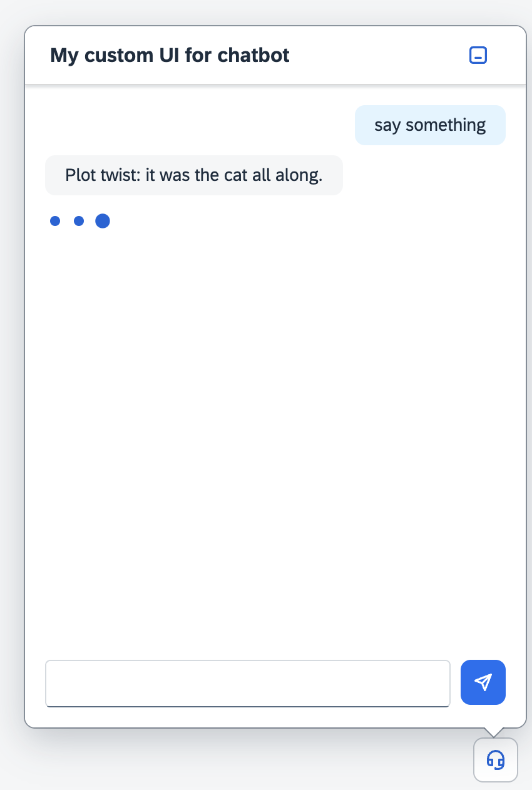

#  Use the `ChatLoading`

The `ChatLoading` is the last missing piece to have a complete chat experience.
It will be shown in the content of the `Chat` while waiting for the response.
We need to do some little touches to make it part of the `Chat`.

<br>

- Update the `src/Chat.ts` class

The `ChatLoading` web component will be just another type of child within the `Chat`.
We will reuse the `message` slot by extending the slot type to accept components of type `ChatLoading`

```diff
+import type ChatLoading from "./ChatLoading.js";

class Chat extends UI5Element {

	@slot({ type: HTMLElement, "default": true })
+	messages!: Array<ChatMessage | ChatLoading>;
```

<br>

- Put it in action

Within our dummy application code, we can now use the `ChatLoading` component
to fill the time between questions and answers:

```diff
chat.addEventListener("ui5-submit", (e: UI5CustomEvent<Chat, "submit">) => {
    const message = document.createElement("my-chat-bubble") as ChatBubble;
    message.type = ChatBubbleType.Assistant;
    message.innerText = e.detail.value;
    chat.appendChild(message);

+ 	const loading = document.createElement("my-chat-loading") as ChatLoading;
+   chat.appendChild(loading);

 	setTimeout(() => {
+ 		loading.remove();

 		const message = document.createElement("my-chat-bubble") as ChatBubble;;
  		message.innerText = responses[Math.round(Math.random() * 9)];
 		chat.appendChild(message);
 	}, 1500)
});
```

<br>
<br>

## Hoooray! Congratulation! Hands-on completed!

<br>
<br>

