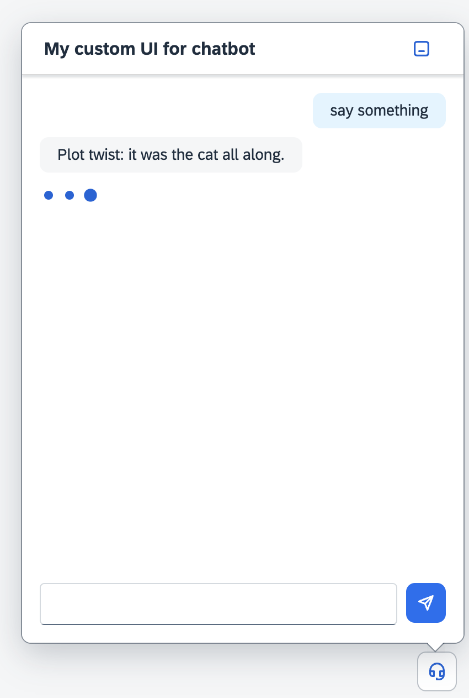

#  Use the `ChatLoading`

The `ChatLoading` is the final piece needed to complete the chat experience.
It provides a visual indicator while waiting for a response

Let’s integrate it into the `Chat` web component with just a few small adjustments.

<br>

## 1. Extend the `messages` Slot in `src/Chat.ts`

The `ChatLoading` will be treated like any other child message inside the Chat.
To support this, update the messages slot to accept both `ChatMessage` and `ChatLoading`.


```ts
import type ChatLoading from "./ChatLoading.js";

class Chat extends UI5Element {

	@slot({ type: HTMLElement, "default": true })
	messages!: Array<ChatMessage | ChatLoading>;
```

<br>

## 2. Show `ChatLoading` Between Messages

In your app code, you can now insert a `<my-chat-loading>` 
to simulate the delay before the assistant responds.


```html
	<my-chat id="myChat"></my-chat>

	<script>

		const myChat = document.getElementById("myChat");

		myChat.addEventListener("submit", (e) => {
			const newMessage = document.createElement("my-chat-message")
			newMessage.textContent = e.detail.value;
			myChat.appendChild(newMessage)

			const loading = document.createElement("my-chat-loading");
   			myChat.appendChild(loading);

			setTimeout(() => {
				loading.remove();

				const newAssistantMessage = document.createElement("my-chat-message")
				newAssistantMessage.type ="Assistant";
				newAssistantMessage.textContent = "This is my response";
				myChat.appendChild(newAssistantMessage)
			}, 1500);
		})
	</script>
```

This creates a natural pause before the assistant replies, enhancing the realism of the chat.

<br>

## 🎉 Congratulations — You Did It!

You’ve now completed the hands-on and built a fully functional web component-based chat experience, 
complete with messages, styling, interaction, and loading feedback.

<br>

